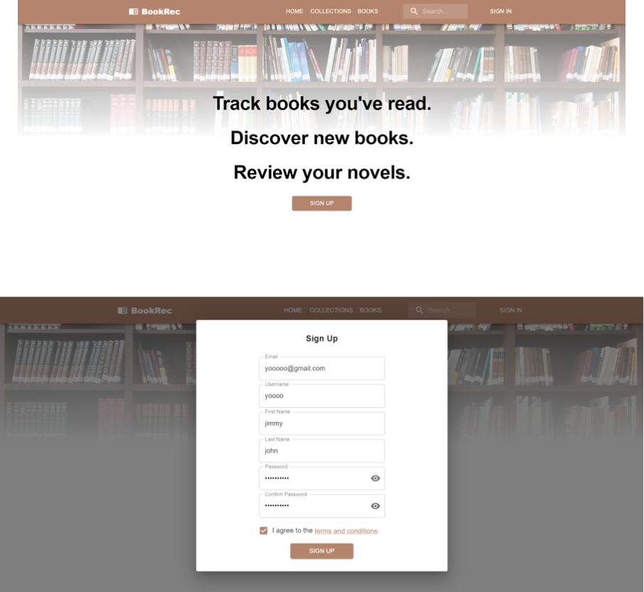

# Book Recommendation System 📖

### 📸 &nbsp; Some Screenshots 

----------

# Backend
## Prerequisites
- Install Python 3.10.x or later.
- If not installed, install the `venv` module version  3.3 or later by following item 2.

## Set-up
In order to set up the backend of the application you must:
1. Type `cd backend` into the terminal from the `../capstone-project-3900w18cgroup1` directory.
2. Type `pip install virtualenv` to get the module needed to create the virtual environment.
3. Type `mkdir <name_of_virtual_environment>` into the terminal to create the folder to store the virtual environment.
4. Type `cd <name_of_virtual_environment>` into the terminal to change to the newly created folder.
5. Type `python -m venv .` to set up the files needed for the virtual environment. This may take some time.
  - If `python -m venv .` does not work. Try to substitute `python` for `python3` or to give an absolute path for the location of the folder created in step 3 instead of using `.`(dot).
6. Type `cd Scripts/` and with your preferred text editor open the activate (no extensions).
7. Find the line wherein the following code is written: `export PATH`
8. Add the following lines underneath `export PATH` and save your changes: 
  - `export DB_USR=”admin”`  
  - `export DB_PWD=”zs9k2g7xnkdaSZo8”`
  - `export MAIL_USR=”bookrec.group1@gmail.com”`
  - `export MAIL_PWD=”botbqujrswxrlrjk”`
  - `export API_KEY={Your own Google Books API Key}`
  - `export NYT_API_KEY=”{Your own New York Times API Key}”`
  
    Note: In step e make sure there are no quotation marks before or after the API key.
  Replace `{Your own Google Books API Key}` with your own Google Books API key. You can obtain an API key by following the documentation provided by Google Books.
  Replace `{Your own New York Times API Key}` with your own New York Times API key. You can obtain an API key by signing up for an account on the New York Times Developer Portal.

9. Type `source activate` into the terminal to start the virtual environment. You should notice the name of your virtual environment in parentheses in the terminal
 Navigate back to the backend directory by typing `cd ../..` or by any other method you prefer.
10.  You should  still be able to see the name of your virtual environment in parentheses. Type `pip install -r requirements.txt` into the terminal to download all the requirements for the backend. This process may take some time.
11.   Type `python download_words.py` to download word lists needed for the recommender system. This may take some time.
  - Again if `python` does not work try `python3`.
12.   Type `python app.py` into the terminal to start the flask server.
  - If the command does not work try using `python3` instead.

----------

# Frontend
## Prerequisites
- Install Node 16.x and the latest version of Node Package Manager (`npm`)

## Development
Use these steps if running the frontend in development mode. 
1. Open the terminal and `cd` into the `frontend` folder of the `capstone-project-3900w18cgroup1` directory with the command: `cd frontend`
2. Type into the terminal `npm install`
3. Replace the `REACT_APP_API_ENDPOINT` variable in the `.env` file in the root of the project folder with the URL of the running backend server  (by default this is `http://127.0.0.1:5000/`)
4. After installation has completed, type `npm start`
5. The frontend will automatically open and will be running on `http://127.0.0.1:3000/`. Ensure you visit `127.0.0.1` instead of `localhost` to prevent Cross-Origin Resource Sharing issues on some browsers.
6. To run the linter, type `npm run lint`

## Production Build
1. Open the terminal and `cd` into the `frontend` folder of the `capstone-project-3900w18cgroup1` directory with the command: `cd frontend`
2. Type into the terminal `npm install`
3. Replace the `REACT_APP_API_ENDPOINT` variable in the `.env` file in the root of the project folder with the URL of the `backend` server (by default this is `http://127.0.0.1:5000/`). Ensure you use `127.0.0.1` instead of `localhost` to prevent Cross-Origin Resource Sharing issues on some browsers.
4. To create the production build type into the terminal `npm run build`
5. Type into the terminal `cd build`
6. To start the server on `127.0.0.1` port `3000`, type into the terminal `npx http-server -c-1 -p 3000 -P "http://127.0.0.1:3000?" --cors`.
Replace the port `3000` with your desired port. Press `Y` if prompted to install the `http-server` package. 
If you update the port, you will need to modify the port in the `app_name` variable in `auth.py` in the `auth_recover` function.
7. The frontend will be running on `http://127.0.0.1:<port>`. Ensure you visit `127.0.0.1` instead of `localhost` to prevent Cross-Origin Resource Sharing issues on some browsers.
